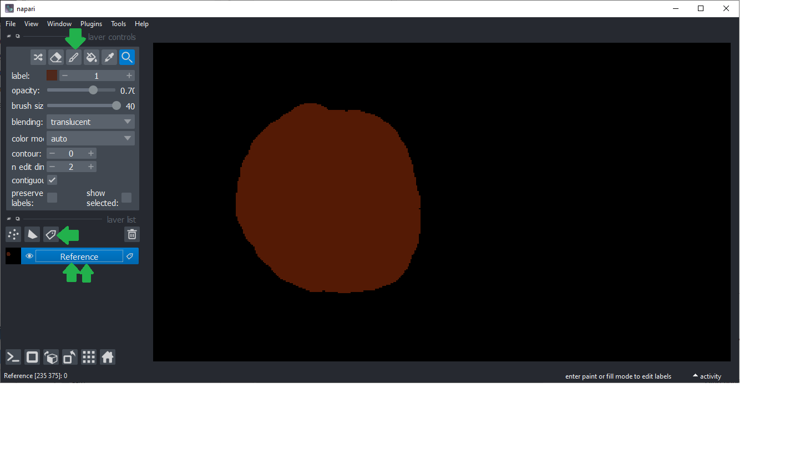
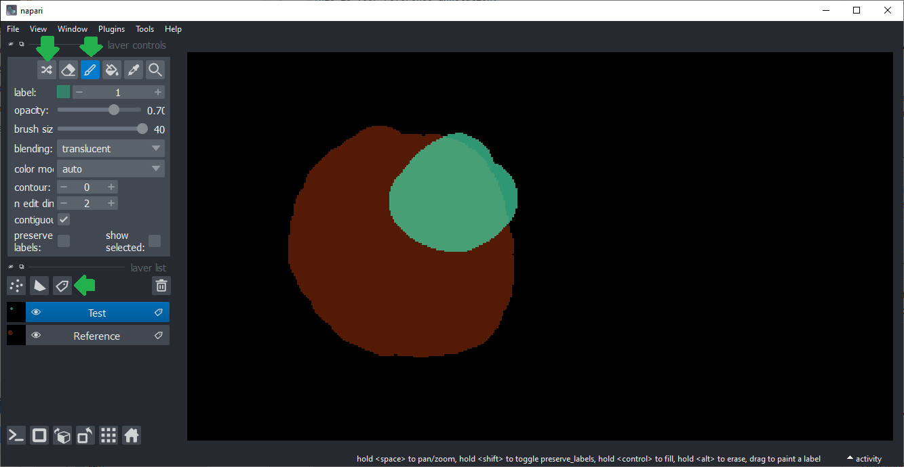
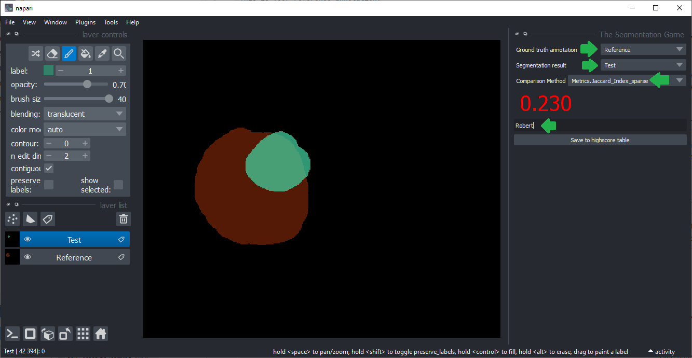
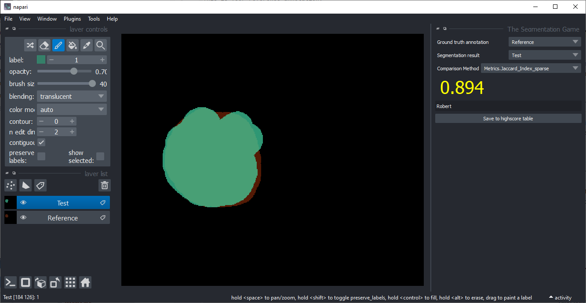
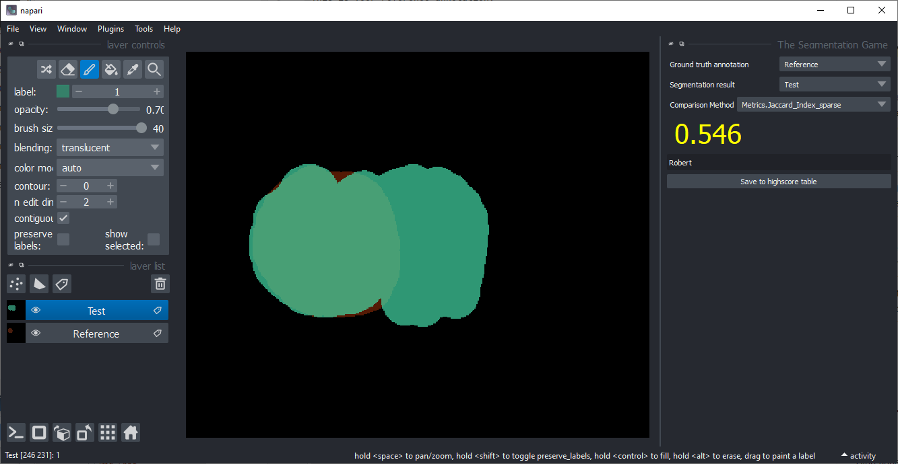
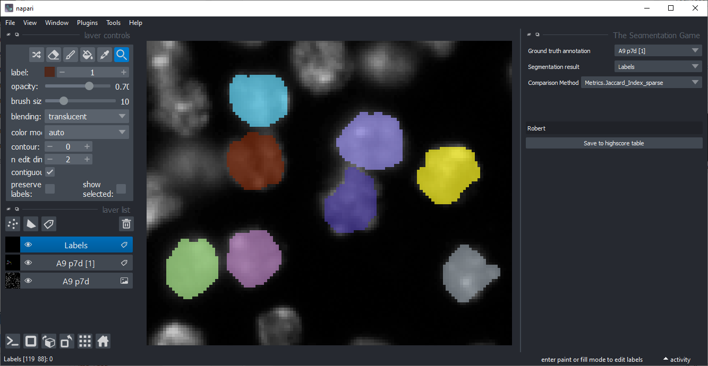
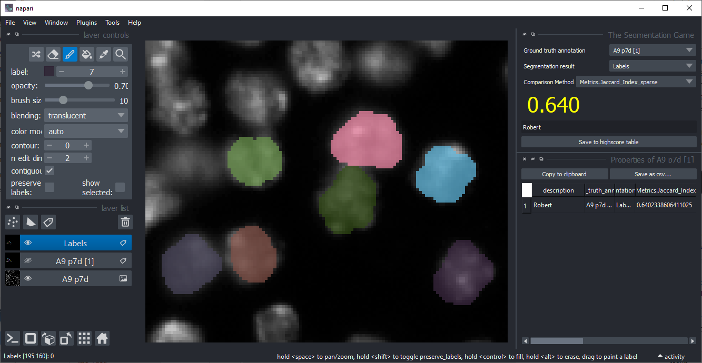

# The Segmentation Game

[The Segmentation Game](https://www.napari-hub.org/plugins/the-segmentation-game) is a napari plugin for determining segmentation quality. 
It is interactive and thus, you can beat each other in segmenting objects with high quality and collect your results in a highscore table.

Goal of playing this game is to give your some feeling for what it means if the quality of a segmentation algorithm is e.g. 80%.

## How to play
Start napari, add a new labels layer and draw a large circle. Rename the layer to "Reference". 
This is your reference annotation.

Add another labels layer, randomize its colours and start drawing another circle, 
partially overlapping with the first one. Rename that second layer to "test"
Make sure you are drawing on the second layer.

Start the game by clicking the menu `Tools > Games > The Segmentation Game`. 
Select the "Reference" image and "Test" as segmentation result. 
Choose the metric "metrics.Jaccard_index_sparse". Enter your name.
At this point, you will see that the overlap of the two drawn labels is small:

If you continue drawing the second label so that it overlaps more, the Jaccard Index will increase:

If you draw too much of label 2, the Jaccard Index will decrease again.

## Play the game!

Close all layers in napari and open the image `data/BBBC007_batch/A9 p7d.tif` and the corresponding 
label image `data/BBBC007_sparse_instance_annotation/A9 p7d.tif`. 
Add another labels layer.
Zoom into where the labels were drawn.
Configure The Segmentation Game like shown here:

Hide the ground truth annotation layer (don't cheat!) and start drawing labels on the nuclei. 
Try to achieve a good segmentation result. Time limit: 2 minutes! 

Afterwards, save your result to the Highscore table. 
Exchange the seat with your neighbor and annotate on their computer.

Who has the highest Jaccard index?