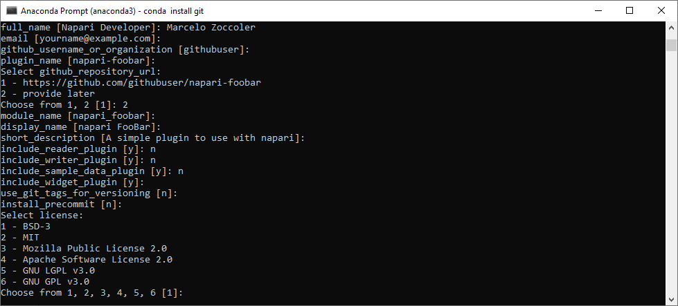
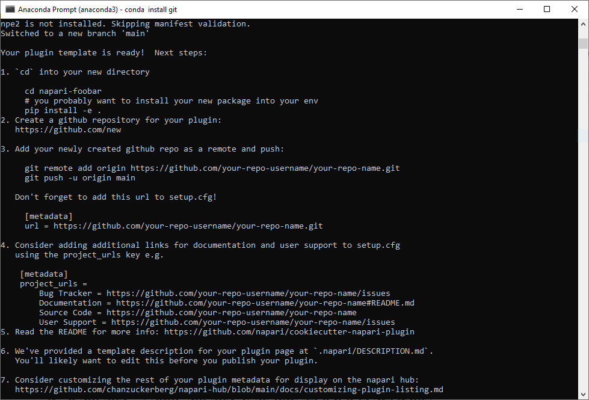
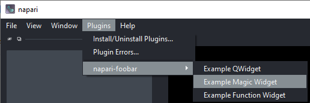
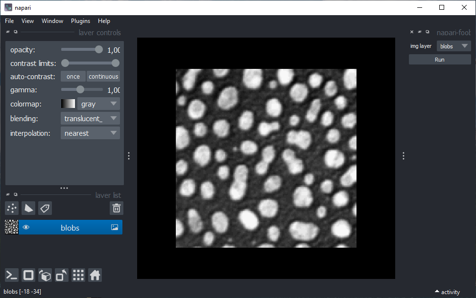
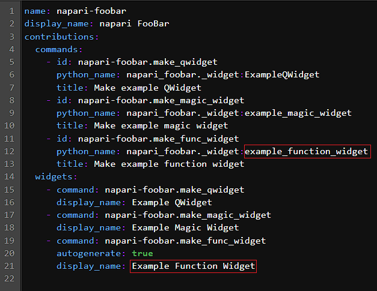
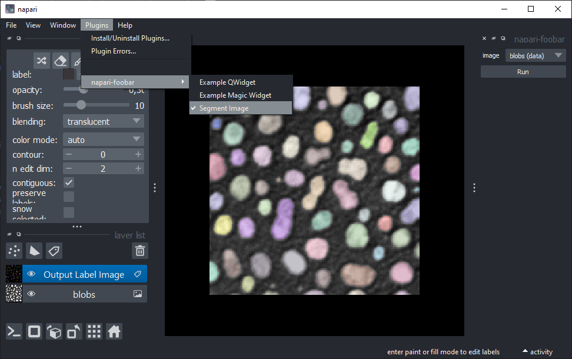
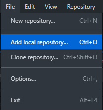
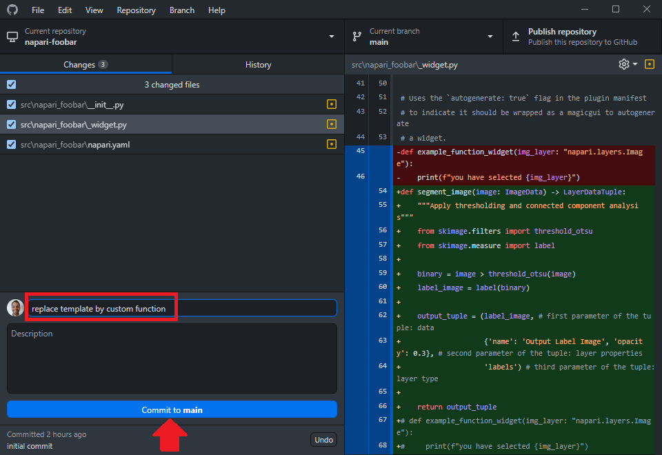
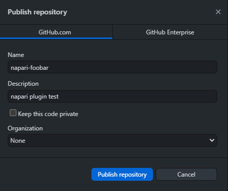

# Creating a plugin from a template using the cookiecutter

## Creating a template

The easiest way to make a napari plugin is by using the [napari-cookiecutter](
https://github.com/napari/cookiecutter-napari-plugin#cookiecutter-napari-plugin). Let's install it.

Well, first things first: create a new conda environment with napari and jupyter lab. ("Another one?" 😩) Yes, better safe than sorry 😉. Don't forget to activate it.

    conda create -n napari-plugin-env python=3.9 napari jupyterlab -c conda-forge
    conda activate napari-plugin-env

Then, let's install and run the cookiecutter as indicated in the [napari cookiecutter repository]([https://github.com/napari/cookiecutter-napari-plugin](https://github.com/napari/cookiecutter-napari-plugin#cookiecutter-napari-plugin)):

```
pip install cookiecutter
cookiecutter https://github.com/napari/cookiecutter-napari-plugin
```
(`'git' is not installed.` ?? 🙀 -> `conda install git` 😸)

The cookiecutter will then start asking you questions about your project. You can just hit Enter to skip the answer and accept a default answer (showns within square brackets). We guide answers one by one below, but here is an overview of the questions:



  1. `full_name [Napari Developer]:` ***type your name***
  2. `email [yourname@example.com]:` **type your email** *or skip*
  3. `github_username_or_organization [githubuser]:` **type your github username** *or skip*
  4. `plugin_name [napari-foobar]:` **type your plugin name** *or skip*
  5. `Select github_repository_url:`  
     `1 - https://github.com/your_github_username/your_plugin_name`  
     `2 - provide later`  
     `Choose from 1, 2 [1]:`  **type '2'** 
  6. `module_name [flood_napari]:` *skip*
  7. `short_description [A simple plugin to use with napari]:` *skip*
  8. `include_reader_plugin [y]:` **type 'n'**
  9. `include_writer_plugin [y]:` **type 'n'**
  10. `include_sample_data_plugin [y]:` **type 'n'
  11. `include_widget_plugin [y]:` **type 'y'**
  12. `use_git_tags_for_versioning [n]:` *skip it or type `n`*
  13. `install_precommit [n]:` *skip*
  14. `Select license:`  
       `1 - BSD-3`  
       `2 - MIT`  
       `3 - Mozilla Public License 2.0`  
       `4 - Apache Software License 2.0`  
       `5 - GNU LGPL v3.0`  
       `6 - GNU GPL v3.0`  
      `Choose from 1, 2, 3, 4, 5, 6 [1]:` *choose a license, you can also change this later if you want, check options [here](https://ufal.github.io/public-license-selector/)*
      
Done! You will see the screen below with further instructions. 



Before that, check if you find now a new folder called "napari-foobar" in the path where you opened the command line.

## Installing the template plugin locally

Then, we will just do instruction number 1 to install this default napari plugin locally. 
```
cd napari-foobar    # replace 'napari-foobar' by your plugin name if you gave it a different name
pip install -e .   # install your plugin locally
```
Now, open napari from the command line and open an image in it.

If we check the "Plugins" menu, we should see a new entry with your plugin there and three options.



Click on the "Example Magic Widget" option. A widget should be docked on the right side of the viewer:



Click on the "Run" button and then take a look at the command line. You should see a text like "you have selected blobs". This is the default behavior of this template plugin: it prints the selected layer name.

## Updating the template with your functions

We need to replace a few things in a couple of files to change these widgets to the ones we have created before.
Close napari and open jupyter lab. Navigate to the "napari-foobar" -> "src" -> "napari_foobar" and open the `_widget.py` file. On the last line of this file, we have the following function:

```Python
def example_function_widget(img_layer: "napari.layers.Image"):
    print(f"you have selected {img_layer}")
```

Replace this function by the `segment_image2` annotated function, shown here again:

```Python
def segment_image2(image: ImageData) -> LayerDataTuple:
    """Apply thresholding and connected component analysis"""
    from skimage.filters import threshold_otsu
    from skimage.measure import label
    
    binary = image > threshold_otsu(image)
    label_image = label(binary)
    
    output_tuple = (label_image, # first parameter of the tuple: data
                    {'name': 'Output Label Image', 'opacity': 0.3}, # second parameter of the tuple: layer properties
                    'labels') # third parameter of the tuple: layer type
    
    return output_tuple
```

Remember to import napari custom types at the beginning of the file: add `from napari.types import ImageData, LayerDataTuple` close to other imports at the top of the file. Save this file (File menu -> Save Python File).

We now have to update the `napari.yaml` file to change the entries in the plugins menu. Thus, open the `napari.yaml` file. You should see a file like this:



Replace the fields indicated in red by your function name. The first one must be exaclty the function name (in this case: `segment_image2`), while the last one is the name that will show up in the Plugins menu. Save the yaml file (File menu -> Save YAML File).

Done! Now open napari again. You should see that one entry of the menu got updated with the name you provided. If you click on it, your plugin should appear on the right side. Try it out!



## Adding your local repository to Github

We will use [Github Desktop](https://desktop.github.com/) to publish your local repository into the Github page. 

Let's add your local repository by clicking on 'File -> Add local repository...'.



After that, you have to specify your local plugin repository path. It should be a directory located where you were when you typed cookiecutter commands (typically 'C:/Users/Your_user_name' for Windows) and it should have the plugin name.

Find it and click on 'Add repository'. You will see that it now appears as the current repository. If you see changes, like in the image below, give them a brief description in the highlighted red box below and click on the button "Commit to main".



Lastly, click on 'Publish repository'. A new window should pop-up.



There you can provide a brief description to the repository if you like (you can do that later) and choose if your repository will be private or public. For this exercise, please choose public.

Done! You can check in your Github page that you have a new repository with your first napari plugin! 🎉 🚀 
